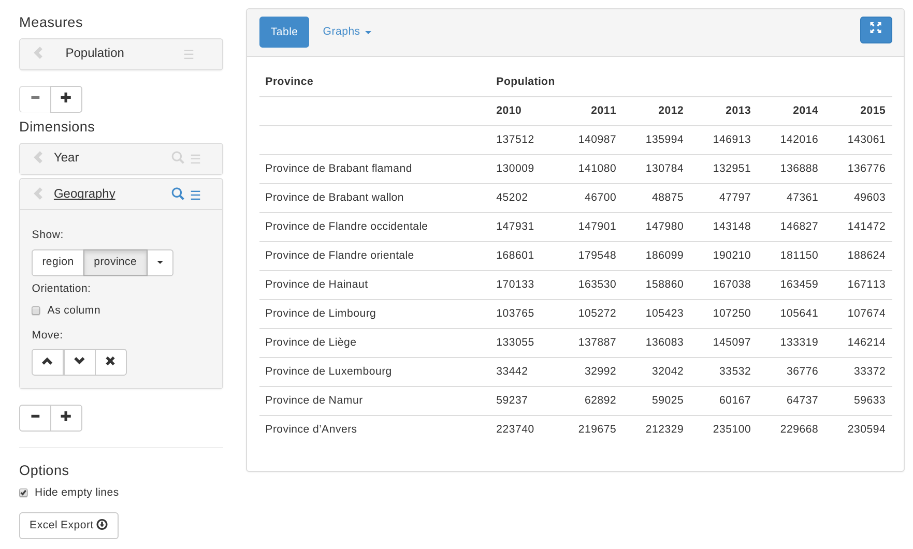

# Flask-Menger

Flask-Menger is a blueprint that provides a web-ui on for the Menger
OLAP library.

## Minimal example

    from flask import Flask

    from menger import dimension, Space, measure
    import flask_menger

    class Population(Space):
        geography = dimension.Tree('Geography', [
            ('region', 'Region'),
            ('province', 'Province'),
        ], str)
        year = dimension.Tree('Year', [('year', 'Year')], int)
        population = measure.Sum('Population', int)

    app = Flask(__name__)
    app.register_blueprint(flask_menger.menger_app)
    app.config['MENGER_DATABASE'] = my_database.db'
    app.run(debug=True)

If you run the above code and open `localhost:5000` in your browser
(and if `my_database.db` is populated) you should see something like:

